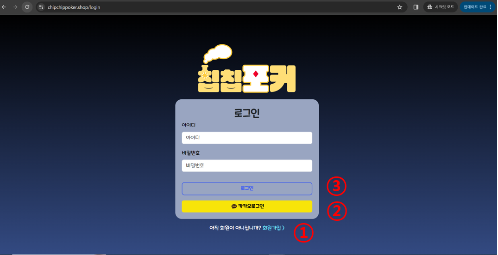
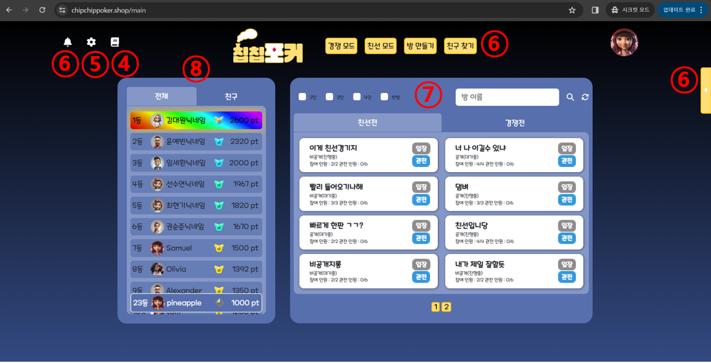
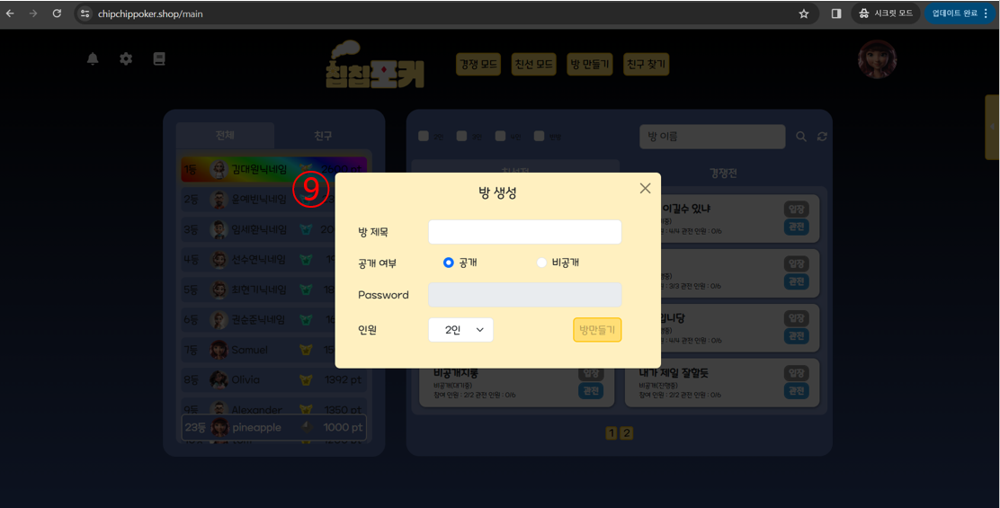
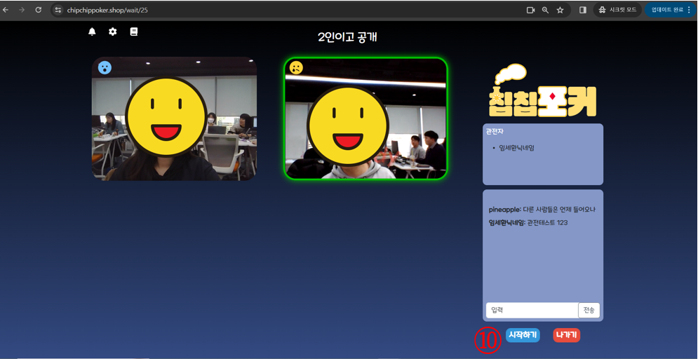
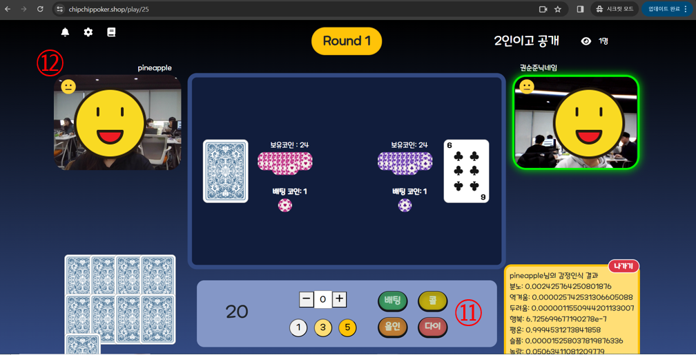
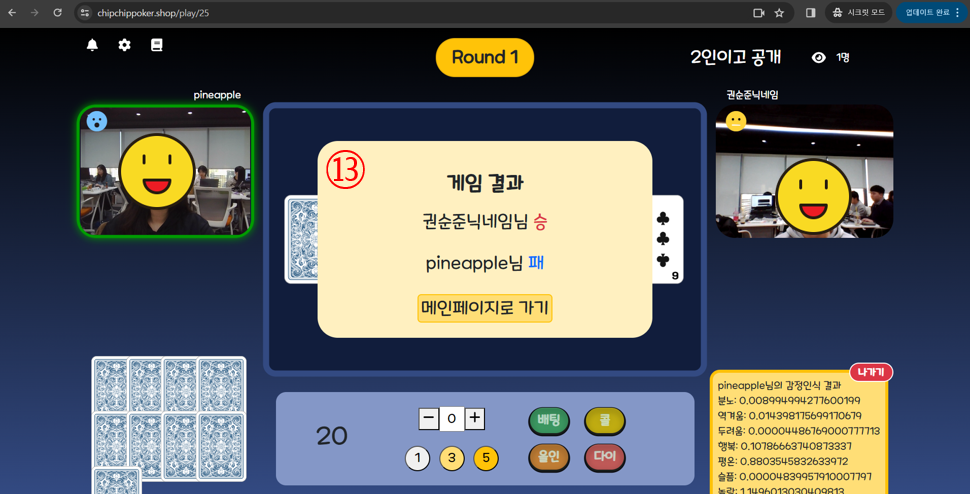
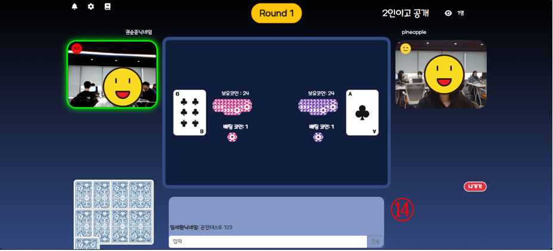
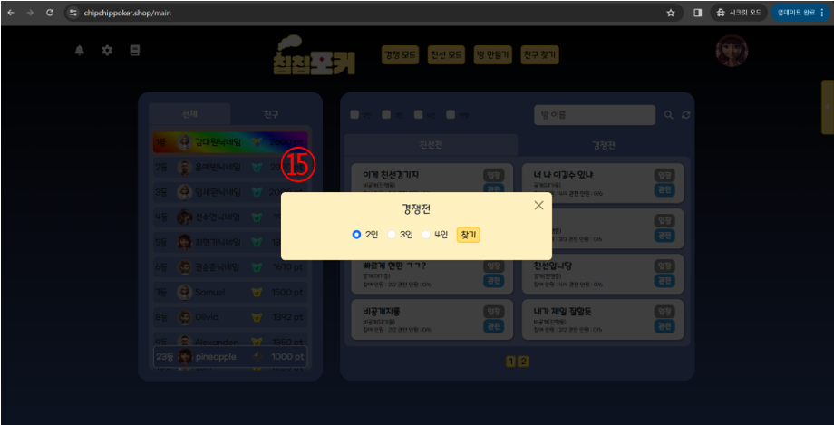
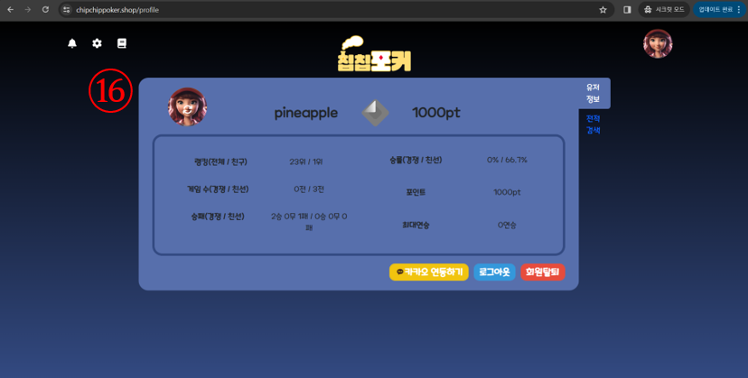

# 시연 시나리오

1. ①번 클릭하여 회원가입
    - 칩칩포커 서비스를 이용하기 위해서는 회원가입이 선행되어야 합니다.
2. ②번 클릭하여 카카오 로그인
    - 접근을 쉽게 하기 위해 회원가입을 거칠 필요 없이, 단순히 카카오 계정으로 로그인 해도 즐길 수 있게 되어있습니다.
3. ③번 클릭하여 일반 로그인

1. 게임 가이드
    - 게임 규칙에 대한 가이드를 확인할 수 있습니다.
2. 설정
    - BGM과 효과음을 조절할 수 있습니다.
3. 친구 검색 및 목록
    - 친구를 검색해서 친구 요청을 보낼 수 있습니다.
    - 친구 요청을 받으면 알림을 통해 확인할 수 있습니다.
    - 친구 목록과 친구의 온/오프라인 상태를 확인할 수 있습니다.
4. 게임방 검색 및 목록
    - 필터 조건을 통해 게임방을 조회하고 검색할 수 있습니다. 게임방은 크게 친선과 경쟁으로 분류됩니다.
5. 랭킹
    - 랭킹은 점수를 기준으로 반영되며, 해당 점수에 맞는 티어가 부여됩니다. 이를 통해 서비스의 모든 사용자들 중 나의 랭킹과, 나와 친구인 사용자들 중 나의 랭킹을 확인할 수 있습니다.

1. 게임방 생성
    - 다른 사람들도 자유롭게 내가 만든 게임에 참여할 수 있도록 하기 위해서는 공개로 설정하고, 그렇지 않은 경우는 비밀번호 입력과 확인 절차가 동반됩니다.

1. 게임 시작
    - 게임을 시작하기 위해서는 방장을 제외한 모든 사용자가 준비하기 버튼을 누른 준비 상태여야 합니다. 이후, 방장은 게임을 시작할 수 있습니다.

1. 게임 진행
    - 사용자들은 배팅, 올인, 다이, 콜 기능을 활용할 수 있습니다.
2. 표정 인식
    - 남들이 나의 표정을 보고 패를 가늠하지 못하게 하는 인디언 포커의 특성을 살리기 위해, 표정 인식 기능을 활용할 수 있습니다.

1. 게임 결과
    - 게임 종료 후에는 게임 결과를 확인할 수 있습니다.

1. 관전 
    - 게임을 관전할 수 있는 관전 기능도 존재합니다. 관전자들끼리 채팅도 하고 플레이어로 참여하지 않더라도 게임을 즐길 수 있습니다.

1. 빠른 시작
    - 빠른 시작 기능을 활용하면, 일일이 방을 검색하지 않아도 들어갈 수 있는 방을 찾아줍니다. 친선 모드의 경우, 포인트는 얻지 못하지만 게임을 즐길 수 있는 방을 찾아줍니다. 경쟁 모드의 경우, 포인트를 얻고 게임을 즐길 수 있는 방을 찾아줍니다. 만약, 시간이 지나도 게임방을 찾지 못한다면 중단할 수 있습니다.

1. 마이페이지
    - 마이페이지에서는 포인트나 랭킹 등 정보를 조회할 수 있습니다. 전적 검색에서는 최근 10개의 게임 전적을 확인할 수 있습니다.